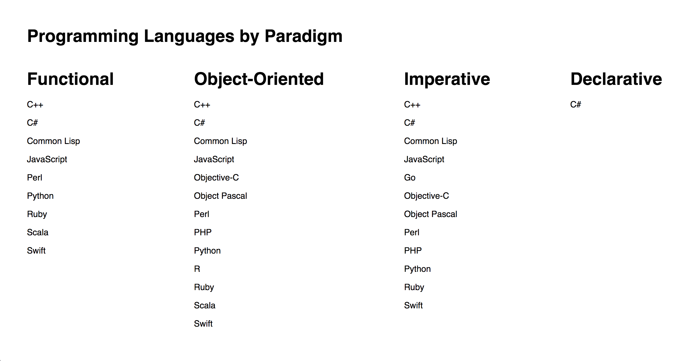

# React Code Challenge Practice

Some programming languages support more than one programming style. In `src/languageList` you are given a list of programming languages and their programming styles (or paradigms). You are also given the list of paradigms separately.

Your goal is to render all the programming languages in a list under their associated paradigms as pictured below. (Most languages will have more than one paradigm.) Structure your state and props in order to best accomplish this task. If you have extra time, try adding some on click functionality to each language name.

